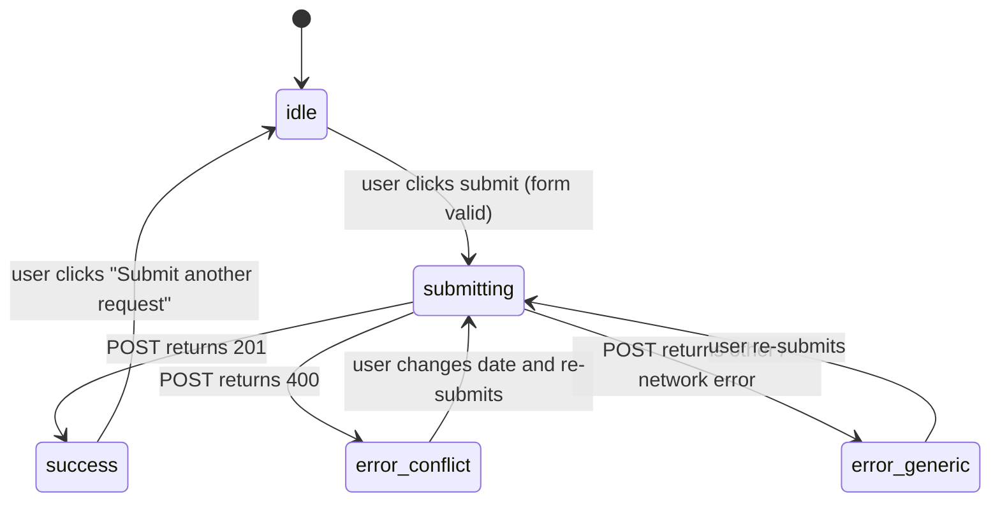

# Design Document — Landing Page Update

## Overview

This document describes the technical design for refactoring `frontend/app/page.tsx` into a polished, single-page, auto-scrollable website for the Shyam Bhajan Seva platform.

The primary goals are:

1. **Remove the duplicate header** from `layout.tsx` so the page's own sticky Navbar is the sole top-level navigation element.
2. **Replace all `lucide-react` imports** with inline SVG paths, eliminating the external icon dependency entirely.
3. **Restructure the page** into four scroll-linked sections (Home/Hero, About Us, Book Your Date, Contact Us) navigable via a sticky Navbar using `useRef` and `scrollIntoView`.
4. **Wire the booking form to the real API** — `POST /api/bookings` for submission and `GET /api/bookings` for the booked-dates indicator — replacing the existing `setTimeout` simulation.

### Tech Stack

| Layer     | Technology                        |
|-----------|-----------------------------------|
| Framework | Next.js 16                        |
| UI        | React 19 (client components)      |
| Styling   | Tailwind CSS 4                    |
| Backend   | FastAPI at `http://localhost:8000` |
| Icons     | Inline SVG paths only             |

---

## Architecture

The refactored landing page is a single **React Client Component** (`'use client'`) inside the existing Next.js App Router. No new routes, API routes, or additional packages are introduced.

```
frontend/app/
├── layout.tsx          ← Remove <header> element; keep <html> + <body> + metadata
└── page.tsx            ← Single client component containing all four sections
```

### Scroll Architecture

All four sections are mounted in the DOM at all times (no lazy loading, no route changes). Smooth scroll is implemented with `React.useRef` refs attached to each section's wrapper `<div>`, and `ref.current?.scrollIntoView({ behavior: 'smooth' })` called from each Navbar button's `onClick`.

```
Navbar
  ├─ onClick → homeRef.current.scrollIntoView(...)
  ├─ onClick → aboutRef.current.scrollIntoView(...)
  ├─ onClick → bookRef.current.scrollIntoView(...)
  └─ onClick → contactRef.current.scrollIntoView(...)

page body
  ├─ <div ref={homeRef}>    Hero Section
  ├─ <div ref={aboutRef}>   About Us Section
  ├─ <div ref={bookRef}>    Book Your Date Section
  └─ <div ref={contactRef}> Contact Us Section
```

### API Interaction

```
Component mount
  └─ useEffect → GET /api/bookings → setBookedDates([...dates])

Form submit
  └─ handleSubmit → POST /api/bookings (payload) → on 201: reset + refresh bookings
                                                  → on 400: show "date taken" error
                                                  → on other: show generic error
```

---

## Components and Interfaces

### Top-Level Component: `Home` (page.tsx)

```typescript
'use client';

// State
const [formData, setFormData] = useState<BookingFormData>({...})
const [isSubmitting, setIsSubmitting]   = useState(false)
const [submitStatus, setSubmitStatus]   = useState<SubmitStatus>('idle')
const [bookedDates, setBookedDates]     = useState<string[]>([])
const [dateConflict, setDateConflict]   = useState(false)

// Refs
const homeRef    = useRef<HTMLDivElement>(null)
const aboutRef   = useRef<HTMLDivElement>(null)
const bookRef    = useRef<HTMLDivElement>(null)
const contactRef = useRef<HTMLDivElement>(null)

// Helpers
function scrollTo(ref: React.RefObject<HTMLDivElement>): void
function fetchBookedDates(): Promise<void>
async function handleSubmit(e: React.FormEvent): Promise<void>
function handleInputChange(e: React.ChangeEvent<...>): void
```

#### Sections (rendered inline, not as separate files)

| Section ID    | Ref         | Description                                      |
|---------------|-------------|--------------------------------------------------|
| Hero          | `homeRef`   | Gradient banner, headline, subtitle, Book Now CTA |
| About Us      | `aboutRef`  | Descriptive text, feature list, gallery grid     |
| Book Your Date| `bookRef`   | Booked dates panel + booking form                |
| Contact Us    | `contactRef`| Phone, email, location cards                     |

### `layout.tsx` Change

The `<header>` element (and its contents) is removed from `RootLayout`. The `{children}` prop is rendered directly inside `<body>`.

```typescript
// Before
<body>
  <header>...</header>
  {children}
</body>

// After
<body>
  {children}
</body>
```

---

## Data Models

### `BookingFormData` (client-side state)

```typescript
interface BookingFormData {
  full_name: string;   // maps to backend full_name
  phone:     string;   // maps to backend phone
  address:   string;   // maps to backend address
  booking_date: string; // ISO 8601 date string, e.g. "2026-07-15"
  notes:     string;   // not sent to backend (optional UI field)
}
```

### `BookingCreatePayload` (sent to backend POST /api/bookings)

```typescript
interface BookingCreatePayload {
  full_name:    string;
  address:      string;
  phone:        string;
  alt_phone:    null;          // always null — field not in this form
  booking_date: string;        // ISO 8601 date string
}
```

### `BookingResponse` (received from GET /api/bookings)

```typescript
interface BookingResponse {
  id:           number;
  full_name:    string;
  address:      string;
  phone:        string;
  alt_phone:    string | null;
  booking_date: string;        // ISO 8601 date string
  status:       string;        // "Pending" | "Approved" | "Rescheduled"
}
```

### `SubmitStatus` (UI state machine)

```typescript
type SubmitStatus = 'idle' | 'success' | 'error_conflict' | 'error_generic';
```

Four distinct states replace the current two (`'idle' | 'success' | 'error'`) to support the requirement for different messages on HTTP 400 vs other errors.

---

## Correctness Properties

*A property is a characteristic or behavior that should hold true across all valid executions of a system — essentially, a formal statement about what the system should do. Properties serve as the bridge between human-readable specifications and machine-verifiable correctness guarantees.*

### Property 1: Booking form payload maps all fields correctly

*For any* combination of valid form field values (full name, phone number, address, preferred date), the HTTP POST body sent to the backend SHALL contain `full_name` equal to the Full Name input, `phone` equal to the Phone Number input, `address` equal to the Address input, `booking_date` equal to the Preferred Date input (ISO 8601), and `alt_phone` equal to `null`.

**Validates: Requirement 6.2**

### Property 2: Booked dates panel displays exactly the dates returned by the API

*For any* array of booking records returned by `GET /api/bookings`, the Booked Dates Panel SHALL display a visual entry for every `booking_date` value present in those records — no more, no less.

**Validates: Requirements 7.2, 7.3**

### Property 3: Date conflict warning fires for every booked date

*For any* date value that appears in the booked dates list, entering that exact date value in the Date Picker input SHALL cause the Booking Form to display the "already reserved" inline warning message.

**Validates: Requirement 7.4**

### Property 4: All rendered icons are inline SVG elements

*For any* icon element rendered anywhere in the page, it SHALL be an inline `<svg>` element containing at least one `<path>` child with a `d` attribute — the page SHALL contain no component imports from `lucide-react` or any other third-party icon library.

**Validates: Requirements 2.6, 3.5, 4.5, 8.5, 9.1, 9.2**

---

## Error Handling

### API Submission Errors (Booking Form)

| HTTP Status | `submitStatus` Value | User-Visible Message                                         |
|-------------|----------------------|--------------------------------------------------------------|
| 201 Created | `'success'`          | "Request submitted! We will contact you to confirm."         |
| 400 Bad Req | `'error_conflict'`   | "This date is already reserved. Please choose another date." |
| Other 4xx/5xx | `'error_generic'`  | "Something went wrong. Please try again."                    |
| Network error | `'error_generic'`  | "Something went wrong. Please try again."                    |

The submit button is disabled (`disabled={isSubmitting}`) and shows a spinner SVG while `isSubmitting === true`.

### Booked Dates Fetch Errors

If `GET /api/bookings` throws or returns a non-OK status, the component catches the error silently (`catch(() => {})`) and leaves `bookedDates` as an empty array. The form remains fully functional with no booked-date indicators shown. No error toast or message is displayed to the user.

### Date Conflict Detection (Client-Side)

The `handleInputChange` handler for the `booking_date` field computes `setDateConflict(bookedDates.includes(value))` immediately on every change. This gives instant feedback without an additional API round-trip. The POST request is still sent (the server is the authoritative source); the warning is advisory only.

---

## Testing Strategy

### Framework

The project does not currently have a testing framework installed. The recommended setup is **Vitest** with **@testing-library/react** and **@testing-library/user-event**, which integrates cleanly with the Next.js + Vite-compatible build pipeline.

```bash
npm install --save-dev vitest @testing-library/react @testing-library/user-event @vitejs/plugin-react jsdom
```

### Unit Tests (Example-Based)

These cover specific behaviors, UI states, and edge cases.

| Test                                              | Requirement(s) |
|---------------------------------------------------|----------------|
| Layout renders without `<header>`                 | 1.1            |
| Page renders exactly one sticky navbar             | 1.2            |
| Navbar contains the four nav items with correct labels | 2.3        |
| Clicking a nav item calls `scrollIntoView` with `{behavior: 'smooth'}` | 2.4 |
| "Book Now" button calls `scrollIntoView` on the booking section ref | 3.3 |
| Gallery placeholder renders ≥ 4 cards             | 4.2            |
| Booking form renders all 5 required fields        | 5.2            |
| Date input is `<input type="date">`               | 5.3            |
| No calendar grid widget rendered                  | 5.4            |
| Successful POST (201) shows success message + clears fields | 6.3   |
| POST 400 shows "date already reserved" message    | 6.4            |
| POST 500 shows generic error message              | 6.5            |
| Loading state: submit button disabled + spinner visible | 6.6       |
| Component mount triggers GET /api/bookings        | 7.1            |
| After successful POST, GET is called again        | 7.6            |
| GET failure: no error UI shown, form functional   | 7.5            |
| Contact section displays ≥ 2 phones, ≥ 2 emails, 1 location | 8.1–8.3 |
| No `lucide-react` import present in page.tsx      | 9.1            |

### Property-Based Tests

The recommended library is **fast-check** (`npm install --save-dev fast-check`), which integrates naturally with Vitest.

Each property test runs a **minimum of 100 iterations** and is tagged with a comment referencing the design property it validates.

**Property Test 1 — Booking form payload field mapping**

```
// Feature: landing-page-update, Property 1: Booking form payload maps all fields correctly
// For any valid form input values, the POST body must contain the correctly mapped fields.

fc.assert(
  fc.property(
    fc.record({
      full_name:    fc.string({ minLength: 1 }),
      phone:        fc.string({ minLength: 1 }),
      address:      fc.string({ minLength: 1 }),
      booking_date: fc.date().map(d => d.toISOString().split('T')[0]),
    }),
    (fields) => {
      // Mock fetch, fill form with fields, submit, inspect fetch call body
      // Assert: JSON.parse(fetchBody) deep-equals { ...fields, alt_phone: null }
    }
  ),
  { numRuns: 100 }
);
```

**Property Test 2 — Booked dates panel displays exactly API-returned dates**

```
// Feature: landing-page-update, Property 2: Booked dates panel displays exactly the dates returned by the API
// For any array of booking records, every booking_date appears in the rendered panel.

fc.assert(
  fc.property(
    fc.array(
      fc.record({
        id:           fc.integer({ min: 1 }),
        full_name:    fc.string({ minLength: 1 }),
        address:      fc.string({ minLength: 1 }),
        phone:        fc.string({ minLength: 1 }),
        alt_phone:    fc.option(fc.string()),
        booking_date: fc.date().map(d => d.toISOString().split('T')[0]),
        status:       fc.constantFrom('Pending', 'Approved'),
      })
    ),
    (bookings) => {
      // Mock GET /api/bookings to return bookings
      // Render component, assert every booking.booking_date is present in the DOM
    }
  ),
  { numRuns: 100 }
);
```

**Property Test 3 — Date conflict warning fires for every booked date**

```
// Feature: landing-page-update, Property 3: Date conflict warning fires for every booked date
// For any date in the booked dates list, entering it in the date picker shows the warning.

fc.assert(
  fc.property(
    fc.array(
      fc.date().map(d => d.toISOString().split('T')[0]),
      { minLength: 1 }
    ),
    fc.nat(),  // index to pick which booked date to test
    (dates, idx) => {
      const pickedDate = dates[idx % dates.length];
      // Mock GET to return dates mapped to booking records
      // Render component, set date picker value to pickedDate
      // Assert: "already reserved" warning message is visible
    }
  ),
  { numRuns: 100 }
);
```

**Property Test 4 — All rendered icons are inline SVG**

```
// Feature: landing-page-update, Property 4: All rendered icons are inline SVG elements
// For any render of the page, every icon is an inline SVG with a path d attribute.

// This property is verified by a single render of the full page:
// 1. Render <Home />
// 2. Query all <svg> elements
// 3. Assert each has at least one <path> child with a 'd' attribute
// 4. Assert no element has a class or data attribute tied to lucide-react
// (100 runs not applicable — this is a structural static property; one run suffices
// but the test is placed alongside the PBT suite for traceability)
```

### Integration Tests

These are not automated as part of the CI unit-test suite. They require the FastAPI backend to be running.

| Scenario                              | How to Test                                                        |
|---------------------------------------|--------------------------------------------------------------------|
| POST /api/bookings with valid payload | Submit the form in a browser; verify the booking appears in admin  |
| GET /api/bookings populates the panel | After a booking exists, reload the page; verify the date is shown  |
| Duplicate date returns 400            | Submit the same date twice; verify error message                   |

### Diagram: Component State Machine (Booking Form)


